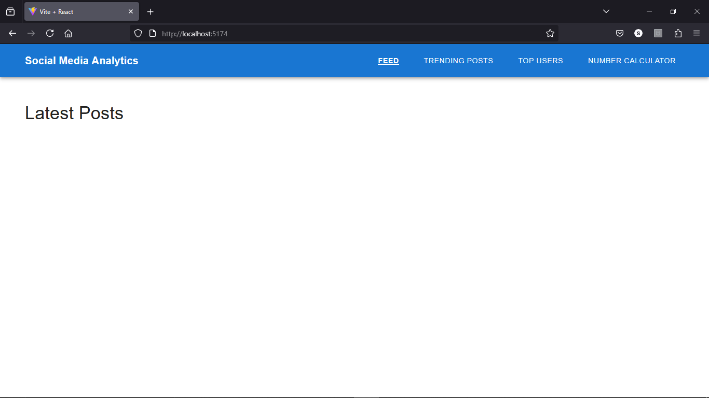

Social Media Analytics with Number Calculator

A React application that combines social media analytics with a number calculation service.

# First_Page

## Features

- Social Media Feed
- Trending Posts
- Top Users Analytics
- Number Calculator
  - Prime Numbers
  - Fibonacci Numbers
  - Even Numbers
  - Random Numbers

## Tech Stack

- React with Vite
- Material-UI
- Axios for API calls
- React Router for navigation

## API Integration

The application connects to the evaluation service API endpoints:
- Base URL: `http://20.244.56.144/evaluation-service`
- Authentication and registration
- Number calculation endpoints
- Social media data endpoints

## Student Details

- Name: Azhagammai
- Roll No: 727622BAD094
- College: Dr.Mahalingam College of Engineering and Technology 
